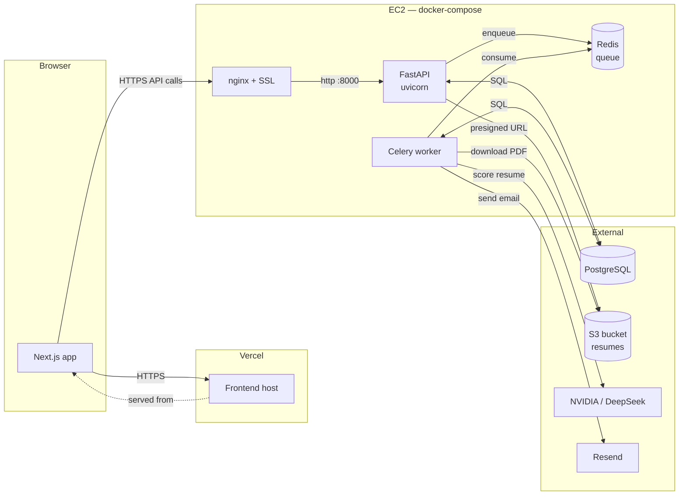

# Recruitizy

AI-native recruitment platform. Recruiters post roles; applicants upload a resume; an AI scoring service ranks every applicant against the job description and auto-shortlists anyone above the recruiter's threshold.

---

## About

Hiring has two universal problems on opposite sides of the table:

- **Recruiters** drown in resumes. A single role can attract a few hundred applicants, most of whom are noise. Screening is done by skimming PDFs and grepping for keywords — slow, biased, and error-prone.
- **Applicants** disappear into application black holes. They submit, they wait, they hear nothing. The signal of "is this role even a fit for me?" never reaches them.

Recruitizy sits in the middle. When an applicant applies, the platform reads the resume, extracts a structured profile, scores it against the job description with an LLM, and either auto-shortlists or auto-rejects based on a recruiter-defined threshold — within seconds. The recruiter opens the dashboard to a ranked list, not a folder of PDFs. The applicant gets an actual response, not silence.

Two surfaces, one platform:

- **For applicants** — upload a resume once, the platform parses it into a structured profile, surfaces matching roles, and tells you where you stand on every application.
- **For recruiters** — post a role with required skills and a score threshold, and let the AI screening run in the background. The shortlist is ready before the recruiter opens the dashboard.

---

## Tech stack

| Layer | Technology | Where it runs |
|---|---|---|
| Frontend | Next.js 16 (App Router), React 19, Tailwind v4, TanStack Query, Zustand, react-hook-form, framer-motion | Vercel |
| Backend API | FastAPI, SQLAlchemy 2.0, Pydantic v2, Alembic, JWT auth (access + httpOnly refresh) | EC2 — Docker |
| Background worker | Celery 5 | EC2 — Docker |
| Queue / broker | Redis 7 | EC2 — Docker |
| Database | PostgreSQL 16 | **External** (RDS / Neon / Supabase) |
| File storage | AWS S3 (resume PDFs, presigned uploads) | AWS |
| AI scoring | OpenAI-compatible client → NVIDIA endpoint → DeepSeek v4 | External |
| Transactional email | Resend | External |
| Reverse proxy / SSL | nginx + Let's Encrypt | EC2 — host |

---

## Architecture



### Key design choices

- **The API stays fast** by offloading every slow operation — AI scoring, PDF text extraction, transactional email — to a Celery worker. The apply endpoint returns in ~200ms even though the AI evaluation itself takes 10–60s.
- **Frontend and backend deploy independently.** A push to `main` rebuilds the frontend on Vercel automatically; the backend redeploys with a single `git pull && docker compose up -d --build` on the EC2 box. They share no build pipeline.
- **Postgres lives outside docker-compose.** The application server is fully stateless — the database can be RDS, Neon, Supabase, whatever — and the EC2 box can be rebuilt, replaced, or scaled without touching the data layer.
- **Resume uploads bypass the backend.** The browser asks the backend for an S3 presigned URL, then `PUT`s the file directly to S3. The backend never sees the bytes — no file-size limits on the API server, no slow streams blocking workers.
- **JWT is split into two tokens.** A short-lived access token (Authorization header) plus a long-lived refresh token (httpOnly cookie). The axios interceptor refreshes transparently on 401, so the user never sees an expired-session error mid-flow.
- **Single image, two roles.** The backend Docker image runs as either the API (`uvicorn`) or the worker (`celery`), branching on its entrypoint argument. One image, one Dockerfile, two services in compose — no drift between them.

---

## Repository layout

```
recruitizy/
├── backend/                       # FastAPI + Celery (Python 3.11+, uv-managed)
│   ├── src/app/
│   │   ├── main.py                # FastAPI app + CORS
│   │   ├── core/
│   │   │   ├── config.py          # Settings from env
│   │   │   ├── security.py        # JWT + password hashing + strength check
│   │   │   ├── deps.py            # Auth dependencies (get_current_user, etc.)
│   │   │   └── celery.py          # Celery app instance
│   │   ├── db/database.py         # SQLAlchemy engine + session
│   │   ├── models/                # SQLAlchemy models
│   │   ├── schemas/               # Pydantic request/response models
│   │   ├── routes/                # FastAPI routers (auth, job, application, resume, applicant)
│   │   ├── services/              # Business logic (auth_service, job_service, ai_service, …)
│   │   └── tasks/                 # Celery tasks (application_tasks, email_tasks)
│   ├── alembic/                   # Migrations
│   ├── Dockerfile
│   ├── docker-entrypoint.sh       # Branches on `api` / `worker` / `migrate`
│   └── pyproject.toml
│
├── frontend/                      # Next.js 16 (App Router)
│   └── src/
│       ├── app/                   # Route segments
│       │   ├── (auth)/            # /login, /signup
│       │   ├── (dashboard)/       # /applicant/*, /recruiter/*
│       │   └── page.tsx           # Marketing landing
│       ├── components/
│       │   ├── landing/           # Hero, ProductInside, AudienceSplit, …
│       │   ├── dashboard/         # Sidebar, header, stats
│       │   ├── profile/           # Applicant profile form + cards
│       │   ├── auth/              # Login / signup / brand panel
│       │   └── ui/                # shadcn-style primitives (button, card, dialog, …)
│       ├── api/                   # axios clients (auth, job, application, resume, applicant)
│       ├── schemas/               # Zod schemas
│       ├── stores/                # Zustand (auth.store)
│       └── lib/api.ts             # Configured axios + 401 refresh interceptor
│
├── docker-compose.yml             # redis + backend + worker
└── README.md
```

---

## How a job application flows through the system

A concrete end-to-end example that touches every component.

1. **Browser → Vercel.** Applicant browses to `/applicant/jobs`, clicks **Apply**.
2. **Vercel → nginx (EC2) → backend.** Frontend issues `POST /api/application/{job_id}` with the access token.
3. **Backend** ([`routes/application.py`](backend/src/app/routes/application.py)):
   - Validates the job is `OPEN`.
   - Looks up the applicant's latest resume (S3 key + filename).
   - Inserts an `Application` row with `status=PENDING`.
   - Calls `process_application.delay(application_id)` — pushes a task onto Redis and returns 200 to the browser immediately. **~200ms total.**
4. **Browser** shows "Application submitted" toast and flips the button to **Applied**.
5. **Worker** ([`tasks/application_tasks.py`](backend/src/app/tasks/application_tasks.py)) — running in parallel, polling Redis:
   - Picks up the task.
   - Loads the application + job + resume from Postgres.
   - Downloads the PDF from S3 to a temp file.
   - Extracts text with PyMuPDF.
   - Calls NVIDIA / DeepSeek with the resume text and job description; receives a structured score.
   - Updates `Application.status` to `SHORTLISTED` or `REJECTED` based on the recruiter's threshold.
   - Inserts an `AIScore` row with strengths, missing skills, feedback.
   - Calls Resend to email the applicant the outcome.
6. **Total wall-clock**: API response was instant; the candidate receives the decision email roughly when the AI call completes (10–60s later).

The same fire-and-forget pattern handles **welcome emails** on signup, and **profile sync from resume** when an applicant clicks "Sync with AI" in their profile.

---

## Local development

```bash
cp backend/.env.example backend/.env       # fill in DATABASE_URL, NVIDIA key, AWS keys, etc.
cp frontend/.env.example frontend/.env.local
docker compose up -d                       # redis + backend + worker
cd frontend && npm install && npm run dev  # http://localhost:3000
```

Frontend dev talks to the backend on `http://localhost:8000`. See [`backend/.env.example`](backend/.env.example) and [`frontend/.env.example`](frontend/.env.example) for the full list of environment variables.
